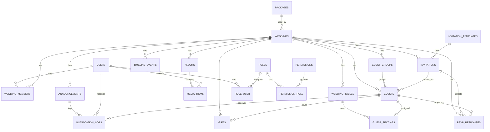

# Srolanh Wedding Management Platform — ERD (v1)

## Table Inventory (Planned)

### Auth & RBAC
- `users` (existing)
- `roles`
- `permissions`
- `role_user`
- `permission_role`

### Core Wedding
- `packages`
- `weddings`
- `wedding_members`

### Digital Invitation
- `invitation_templates`
- `invitations`

### Guests & RSVP
- `guest_groups`
- `guests`
- `rsvp_responses`

### Seating
- `wedding_tables`
- `guest_seatings`

### Gifts
- `gifts`

### Timeline
- `timeline_events`

### Gallery
- `albums`
- `media_items`

### Announcements
- `announcements`
- `notification_logs`

